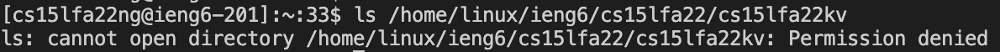
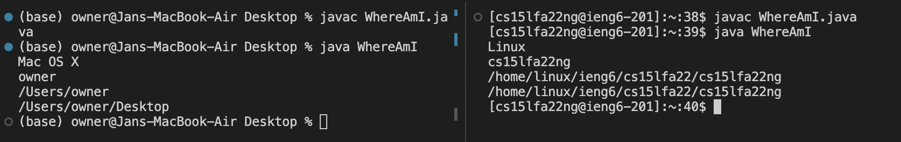

# Remote Access

## Part 1: Installing Visual Studio Code
You can download VS Code through [this link](https://code.visualstudio.com/). If you have successfully set up VS Code, you should be able to see this blank page: 


Open a new terminal on VS Studio to enter commands. To do so on Mac, head to the top of the page, click **Terminal**, then click **New Terminal**. Something like this should be seen once successfully opening a terminal:

***

## Part 2: Remote Connecting
To connect to a remote computer, in your terminal, type in

``` ssh <your username>@ieng6.ucsd.edu ```

Type ```yes``` when you see this message:

``` 
The authenticity of host 'ieng6.ucsd.edu (128.54.70.227)' can't be established.
RSA key fingerprint is SHA256:ksruYwhnYH+sySHnHAtLUHngrPEyZTDl/1x99wUQcec.
Are you sure you want to continue connecting (yes/no/[fingerprint])? 
```

You will be prompted to enter your password. It may not be showing any feedback. But you are indeed typing in your password. It is best to type each character in carefully so you don't have typos in your passwords, which will waste you a lot of time. 

```
Password: 
```

This is what you should be seeing after successfully logging into your remote comptuer:


To log out, use Ctrl+D or type in ```exit```.
***

## Part 3: Trying Some Commands
You can now try out some commands in the terminal:

``` cd ```

The ```cd``` command changes the current directory you're in. For example, ```cd ~``` changes your current directory to your home directory.

``` ls ```

It lists the contents of the directory you're currently in. For example, ```ls ~``` prints out the contents in your home directory:


If you try to ```ls``` a folder of another person's account, your access will be denied:


``` cat ```

This command prints out the content specified. The following is an example:

***

## Part 4: Moving Files with ```scp```
The ```scp``` command allows us to move files from our own computer to the remote computer we're using. First, create a file called ```WhereAmI.java``` with the following code inside:

```
class WhereAmI {
  public static void main(String[] args) {
    System.out.println(System.getProperty("os.name"));
    System.out.println(System.getProperty("user.name"));
    System.out.println(System.getProperty("user.home"));
    System.out.println(System.getProperty("user.dir"));
  }
}
```

``` getProperty ``` is a command that returns you certain information of your computer. This file will prints out all the important information of your computer (or the remote comptuer you're connected to) such as username and the OS.

It is convenient to have two terminals open side by side: one logged onto your own computer and one logged onto a remote computer. Click **Terminal** on the top and hit **Split Terminal** to do so. It will look something like this:


Another step that you can take to maximize your convenience would be to change your directory to your Desktop with your ```WhereAmI.java``` file in it:


We will refer to the terminal connected to your own computer **TerminalA** and the terminal connected to a remote computer **TerminalB** from now on.

In TerminalA, type in the following command:

``` scp WhereAmI.java cs15lfa22zz@ieng6.ucsd.edu:~/ ```

**Make sure** that between the ```:``` and the directory, there is no space being typed in. Otherwise, it will give you an error which can potentially waste you 10 minutes before you can figure out the cause of it (*definitely not speaking from personal experience*).

You will be prompted to enter your password, like when you log onto your account. After a successful copy, you should see something like this: 

```
(base) owner@Jans-MacBook-Air Desktop % scp WhereAmI.java cs15lfa22ng@ieng6.ucsd.edu:~/

WhereAmI.java         100%  304    41.3KB/s   00:00
```

To make sure that your remote computer receives the files, try using ```ls ~``` to list the files in its home directory. 

To run ``` WhereAmI.java ``` on both computers, type in the following commands in both TerminalA and TerminalB:

```
javac WhereAmI.java
java WhereAmI
```

The information shown on both terminals correspond to the computers they are logged on to: they should show different things. It should be something like this:


One noticable difference is the OS systems. On this computer, it is using Mac OS. On the remote computer, it is Linux.
***

## Part 5: Setting an SSH Key
Typing in your passwords every time you have to do something is certainly annoying, and it prompts typos which make waste you a lot of time. One way of bypassing typing in your password everytime you log onto your remote computer is to create a pair of keys with one on each computer. That way, we don't have to type in our passwords everytime we have to do something.

Let's go back to our split terminals. On TerminalA, type in the following code: ``` ssh-keygen ```

Hit **Enter** or **Return** when prompted with 

```
Enter file in which to save the key (/Users/joe/.ssh/id_rsa):
```

Hit **Enter** or **Return** again when prompted with both of these codes:

```
Enter passphrase (empty for no passphrase): 
Enter same passphrase again: 
```

You should see something like this if succeeded:


You will get a directory similar to the following. Save it! You'll need it later!

``` /Users/owner/.ssh/id_rsa.pub ```

Make sure it has ``` .pub ```. It indicates that the file is a public key that should be stored in the ``` .ssh ``` directory in your remote computer.

Now, in TerminalB, log into your cs15lfa22 account, type in the following command to make a new directory for your key. It may have already existed in the computer, but just type it in again just to make sure:

```
mkdir .ssh
```

Then, log out of your cs15lfa22 account.

Back in TerminalA, remember that directory you've save? we have to use the ``` scp ``` command to copy that file to our remote computer at that directory we just created. Type in the following command, using your own directory:

```
scp /Users/owner/.ssh/id_rsa cs15lfa22ng@ieng6.ucsd.edu:~/.ssh/authorized_keys
```

This should be the last time you'll ever have to type in your passwords. It should look something like this:


Try logging into your remote computer in TerminalB. You should be able to without entering your passwords.

***

## Part 6: Optimize Remote Running
Apart from using ssh keys to avoid typing in passwords, there are other ways that can make your remote conection more efficient and smooth. Below are some of the ways of improving efficiency:

``` ssh <your username>@ieng6.ucsd.edu "ls" ```

Writing a command in quotes after your ``` ssh ``` command will allow the command to run directly on the remote server.


``` javac WhereAmI.java; java WhereAmI ```

Using ``` ; ``` to separate commands allows you to run several commands on the same line.


We can run ``` WhereAmI.java ``` more efficiently using the above techniques, with the following code:

```
ssh cs15lfa22ng@ieng6.ucsd.edu "javac WhereAmI.java; java WhereAmI"
```

The result will look something like this:

***

## Conclusion
This is how you remotely connect to a remote computer! There are many different things that you can do on it! Go and try for yourself!


