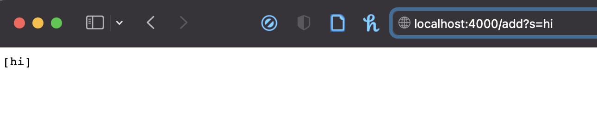

# The Simplest Search Engine

## Part 1: The Code

Here is the code needed to create a very basic and simple search engine:

```

class Search implements URLHandler {
    ArrayList<String> stringList = new ArrayList<>();

    public String handleRequest(URI url) {
        if (url.getPath().equals("/")) {
            return stringList.toString();
        }
        else {
            System.out.println("Path: " + url.getPath());
            if (url.getPath().contains("/add")) {
                String[] parameters = url.getQuery().split("=");
                if (parameters[0].equals("s")) {
                    stringList.add(parameters[1]);
                    return stringList.toString();
                }
            }
            else if (url.getPath().contains("/search")) {
                ArrayList<String> searchReturn = new ArrayList<>();
                String[] parameters = url.getQuery().split("=");
                if (parameters[0].equals("s")) {
                    for (String each: stringList) {
                        if (each.toUpperCase().contains(parameters[1].toUpperCase())) { searchReturn.add(each); }
                    }
                    return searchReturn.toString();
                }
            }
            return "404 Not Found!";
        }
    }
}


class SearchEngine {
    public static void main(String[] args) throws IOException {
        if(args.length == 0){
            System.out.println("Missing port number! Try any number between 1024 to 49151");
            return;
        }

        int port = Integer.parseInt(args[0]);

        Server.start(port, new Search());
    }
}

```

Let's talk about what each piece of code does. We will first create an ArrayList of strings with ``` ArrayList<String> stringList = new ArrayList<>(); ``` . It will be what we return after we carry out our queries. In the ``` handleRequest ``` method, the arguments we take in will be what we type in the URL. 

If the path is empty in the URL, we will return the ArrayList we created, which would include any strings we added into or what we searched for using queries. Now it should be empty because we haven't added any strings into it yet. Here is what it should look like:


We will first run the class SearchEngine to start the server. Make sure your current directory is wavelet. This is the command we will be using:

```

javac SearchEngine.java 
java SearchEngine 4000
Server Started! Visit http://localhost:4000 to visit.

```
4000 is the port number we will be using. After we run the above commands, you will be given a link. In this case, it is ``` http://localhost:4000 ``` . Type this into your browser. We will be using our search engine there.


### Adding:

Now, let's try adding stuff into the ArrayList. To add strings into the ArrayList, type in ``` /add?s=<string> ``` after ``` localhost.4000 ``` . This is the part of the code that will run if your path contains ``` /add ``` :

```

if (url.getPath().contains("/add")) {
                String[] parameters = url.getQuery.split("=");
                if (parameters[0].equals("s")) {
                    stringList.add(parameters[1]);
                    return stringList.toString();
                }
            }

```

The ``` ? ``` indicates a query and will be recognized by the ``` String[] parameters = url.getQuery().split("="); ``` method, which will then split your input into an array at ``` = ``` . Put anything into ``` <string> ``` . This will be what's added in the ArrayList mentioned earlier. In this case, I typed in ``` /add?s=hi ``` and the result looks like this:



We can add more to our list:


### Query:

Here's the fun part. Let's run some queries (searches). To do so, type in ``` /search?s=<strings to search> ``` . This is the part of the code that will run when your path contains ``` /search ``` :

```

else if (url.getPath().contains("/search")) {
                ArrayList<String> searchReturn = new ArrayList<>();
                String[] parameters = url.getQuery().split("=");
                if (parameters[0].equals("s")) {
                    for (String each: stringList) {
                        if (each.toUpperCase().contains(parameters[1].toUpperCase())) { searchReturn.add(each); }
                    }
                    return searchReturn.toString();
                }
            }

```

It will split what you type in in an array like it did for ``` /run ``` . Then, it will loop through our ArrayList of strings (containing the strings we've added in earlier) and add those containing our queries to a new ArrayList. And this new ArrayList, is what will be returned because it contains what we wanted! Here's an example of me searching for strings containing the letter "i":


What if we search for something not in the ArrayList? It will reasonably return us an empty ArrayList:


