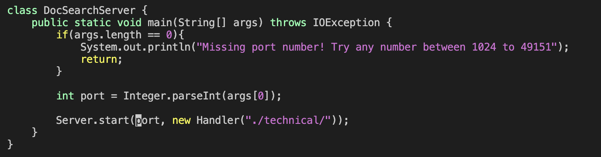
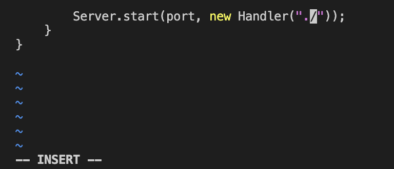
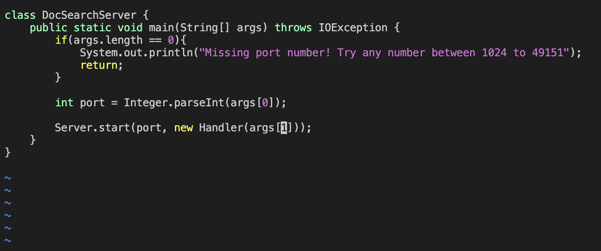

# Vim Commands

## Part 1: Using VIM to change ``` main ``` method

We are going to use the vim method to change the main method in ``` DocSearchServer.java ``` so instead of restricting ourseleves in searching within the ``` ./technical ``` directory, we can search in whatever path passed in as command-line arguments.

This is the full line of keys we will press. (Only 28!)

```

/port<enter>5ece<right_arrow><right_arrow><backspace><backspace><backspace><backspace>args[1]<esc>:wq 

```

### 1. ``` /port<enter> ``` 
After typing in this command, the cursor will jump to ``` port, ``` which is where we want it to be.


### 2. ``` 5e ```
The cursor jumps to the directory ``` ./technical ``` which prepares us to delete it efficiently.


### 3. ``` ce ```
It deletes most of the path except a few characters and enters insert mode for us.


### 4. ``` <right_arrow><right_arrow> ```
It moves the cursor to an appropriate place where we can conveniently delete the remaining characters.


### 5. ``` <backspace><backspace><backspace><backspace> ```
It deletes the unwanted leftover characters.


### 6. ``` args[1] ```
We're changing the code here to " ``` args[1] ``` " !


### 7. ``` <esc> ```
We're getting out of insert mode here as we have just finished our task.


### 8. ``` :wq ```
Saving it and exiting vim!


There we have it! We have successfully made edits using vim within 28 keys!

## Part 2: Seconds Matter

Now, let's do the *same* editing task on *both* the local and remote computers and see which one performs the task faster.

#### Local Computer: 36 s
#### Remote Computer: 27 s

### My Preference for This Task: 
Persoally, when doing this task, I would prefer working on the remote computer because this was a very small edit. Because of the edit's trivialness, editing locally *and* copying the file over to the remote computer is such a hassle, especially if I forget where the file is located on the remote computer. If I somehow copied it to the wrong directory, I would need to spend extra time copying it to the right directory again. 

### Different Projects:
While I prefer the remote method on this task, I would prefer to ``` scp ``` my file to the remote computer after editting locally if I'm making *more* edits or even writing a whole new project. This is because personally, I think editing code using the Visual Studio Code interface is just a more pleasant experience. While different vim commands are definitely convenient, I think I enjoy working with my mouse or trackpad more if I have to navigate through a file if I am making significant edits. This preference can just be due to my inexperience with vim. But as of this moment, if I am making only trivial edits, I would use vim remotely; if I am making significant edits, I would do it locally and copy the file over to the remote computer.
