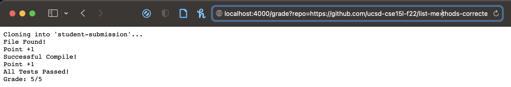
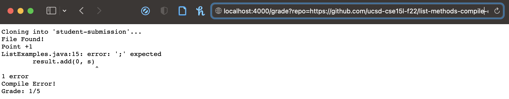
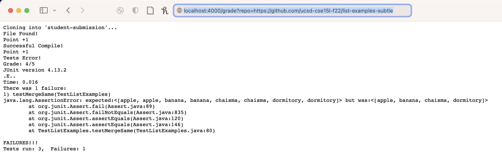

# Grade Script

## My Grade Script

```

set -e

rm -rf student-submission

mkdir student-submission

git clone $1 student-submission

cp TestListExamples.java student-submission
cd student-submission

CPATH=.:../lib/hamcrest-core-1.3.jar:../lib/junit-4.13.2.jar

if [[ -f ListExamples.java ]];
then 
    echo "File Found!"
    echo "Point +1"
else
    echo "File Not Found!"
    echo "Grade: 0/5"
    exit 1
fi

set +e

javac -cp $CPATH *.java

if [[ $? -eq 0 ]]
then
    echo "Successful Compile!"
    echo "Point +1"
else
    echo "Compile Error!"
    echo "Grade: 1/5"
    exit 2
fi

java -cp $CPATH org.junit.runner.JUnitCore TestListExamples > results.txt 

if [[ $? -eq 0 ]]
then
    echo "All Tests Passed!"
    echo "Grade: 5/5"
    exit
else
    FAILURE=$(grep "There " results.txt | grep -Eo "[1-3]")
    PASSED="$((5 - $FAILURE))"
    echo "Tests Error!"
    echo "Grade: $PASSED/5"
    cat results.txt
    exit 3
fi

```

### Example 1 

Corrected Version:

https://github.com/ucsd-cse15l-f22/list-methods-corrected



### Example 2

Compile Error:

https://github.com/ucsd-cse15l-f22/list-methods-compile-error



### Example 3

Failed Tests:

https://github.com/ucsd-cse15l-f22/list-examples-subtle



## The Trace

We will trace through the Example 3.

For the first few lines:

```

rm -rf student-submission

mkdir student-submission

git clone $1 student-submission

cp TestListExamples.java student-submission
cd student-submission

```

We are just deleting the "student-submission" directory and recreating it so we can put a new student submission in to be graded. We also are copying our TestListExamples.java file into the folder which contains our tests for the student mission. Their stdout and stderr would both be empty. The return code, since these lines run wihout an error, would be 0.

Moving on to these lines:

```

if [[ -f ListExamples.java ]];
then 
    echo "File Found!"
    echo "Point +1"
else
    echo "File Not Found!"
    echo "Grade: 0/5"
    exit 1
fi

```

Since this student submission contains the correctly named file (ListExamples.java), the if-statment is true. "File Found!" and "Point +1" would both be echoed. The else-part would not run because the file is found, which fulfills our if-statement condition. The stdout for each of the the echo command would be "File Found!" and "Point +1" accordingly. Their stderr would be empty. Their return codes would also be 0 since they were successful echoes.

Moving on to the compiling stage:

```

javac -cp $CPATH *.java

if [[ $? -eq 0 ]]
then
    echo "Successful Compile!"
    echo "Point +1"
else
    echo "Compile Error!"
    echo "Grade: 1/5"
    exit 2
fi

```

In this student-submission, the file compiled successfully. Hence, the return code would be 0. The stdout and stderr would both be empty since we are just compiling.

Since we have successfully compiled the file, and the exit code is 0, the if-statment is true. "Successful Compile!" and "Point +1" would both be echoed. The stdout for each of the echo command would be what it is echoing. Their stderr would be empty. The return code for each echo command would be 0. Because the if-statment is true (from the successful compiling), the else-block would not be run.

To the tests:

```

java -cp $CPATH org.junit.runner.JUnitCore TestListExamples > results.txt 

if [[ $? -eq 0 ]]
then
    echo "All Tests Passed!"
    echo "Grade: 5/5"
    exit
else
    FAILURE=$(grep "There " results.txt | grep -Eo "[1-3]")
    PASSED="$((5 - $FAILURE))"
    echo "Tests Error!"
    echo "Grade: $PASSED/5"
    cat results.txt
    exit 3
fi

```

We are running the file with the java command, and are redirecting its stdout to results.txt, which contains what will be printed on the webpage (i.e. passed and failed tests). The stderr would be empty for the java command.

Since this particular submission contains a failed test, the exit code of the java command would be nonzero, which makes the if-statment false. Thus, the then-block would not run. Instead, the else-block would run. 

In the else-block, we are grepping the word "There " from its stdout because we want to know how many failtures there are. We will then pipe the grep results to another grep command which grep a number from the statement. The stderr for both of these grep commands would be empty. The stdout for the first grep command (before the pipe) would be "There was 1 failure." The stdout for the second grep command (after the pipe) would be "1". The return codes for both of these grep commands would be 0.

We then have to calculate how many tests the submission has passed by subtracting the number of failed tests grepped in the previous line from the total number of tests, which, in this case, 3. Since the submission also has gotten points from the existence of the file and the successful compiling, we will add the 2 points back to the equation. Hence, we will subtract the number of failed tests from 5. 

We will then echo "Test Error!" of which the stdout will of course be "Test Error!" and the stderr empty. Its return code would be 0.

The next echo command will return the grade this submission gets. Its stdout will be "Grade: 4/5" because this student has failed only 1 of the tests written. Its stderr would be empty. The return code would be 0.

We will then cat results.txt which can provide feedback to the students. The stdout would be the content of results.txt. The stderr would be empty. Its return code would be 0.

We will then close off by exitting with an exit code of 3 as the file contains failed tests.

## Conclusion

This is my grade script! It tests for whether the correct file exists, whether it compiles, and whether it passes all the tests!


